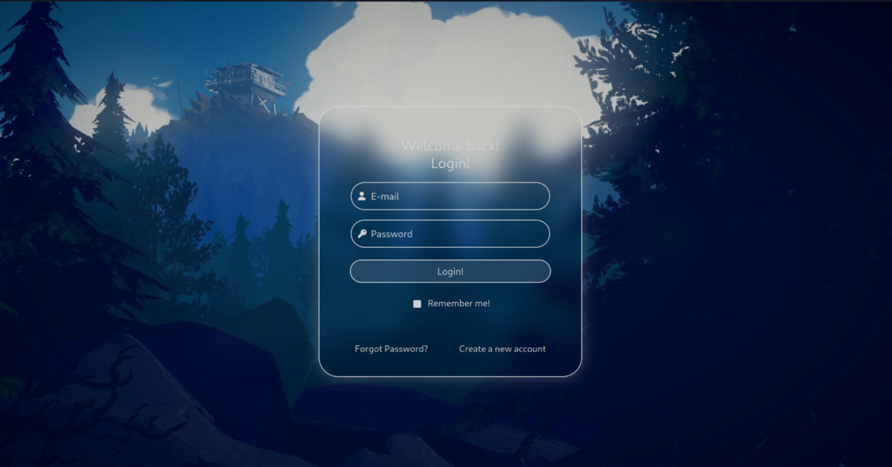

# ✨ Login Screen

A stylish, minimalistic login page with glassmorphism and soft hover animations — perfect for any web project that wants a welcoming and futuristic aesthetic.

## 📋 Features

- **Glassmorphism design** (frosted blur background)
- **Fully responsive** (mobile-friendly)
- **FontAwesome icons** for input fields
- **Custom animations** on link hover
- **Modern, minimal layout**
- **Lightweight** (no external heavy libraries)

## 📸 Preview

> A translucent login box floats over a beautiful wallpaper.  
> Soft glowing interactions guide the user experience.


# ✨ Login Page Customization Guide

Welcome to the full guide on how to **customize your login screen** easily!  
This tutorial will walk you through everything you need — backgrounds, icons, colors, fonts, animations, and more!


### 1. Change the Background Wallpaper

- Go to the images/ folder.

- Replace wallpaper.jpg with your new image (same name or update the link).

- Make sure it's high quality and fits your vibe!

If you want a different image name, update this part in styles.css:

```css
html {
  background: transparent url('images/your-new-image.jpg') no-repeat left center;
  background-size: cover;
}
```

### 2. Change the Favicon (the little tab icon)

- Replace Untitled.png in images/ with your new icon (ideally 32x32px or 64x64px).

- Update this line inside <head> in index.html:

```html
<link rel="shortcut icon" href="images/your-icon.png" type="image/x-icon">
```

### 3. Edit the Welcome Text

Inside the ```<section class="box">``` in index.html, change the text you see:

```html
<h1>Welcome back!</h1>
<h2>Login!</h2>
```

Make it say whatever you want — like:

```html
<h1>Hello, Hacker!</h1>
<h2>Enter your command</h2>
```

### 4. Customize Colors

Colors live inside styles.css.
You can change colors for:

- Backgrounds

- Borders

- Text

- Buttons

- Placeholders

Example: To make the button red instead of blue:

```css
.login {
  background-color: rgba(220, 20, 60, 0.7); /* crimson color */
}
.login:hover {
  background-color: rgba(178, 34, 34, 0.7); /* darker on hover */
}
```

### 5. Change Fonts

By default, it uses system fonts.
If you want something fancy:

- Go to Google Fonts.

- Pick a font.

- Copy the import link into <head> in index.html.

Example:

```html
<link href="https://fonts.googleapis.com/css2?family=Poppins:wght@400;600&display=swap" rel="stylesheet">
```

Then change the font-family inside styles.css:

```css
body, h1, h2, p, a {
  font-family: 'Poppins', sans-serif;
}
```


### 6. Customize Animations (Glow Effects)

The glowing hover effect is made with keyframes:

```css
@keyframes hoverEffect {
  0% { color: white; }
  100% { text-shadow: 0 0 1vh white; font-size: 1.95vh; color: #ffffff; }
}

@keyframes unhoverEffect {
  0% { text-shadow: 0 0 1vh white; color: #ffffff; font-size: 1.95vh; }
  100% { color: white; }
}
```

Want it to pulse, rainbow shift, glitch? you can write your own animation like:
```css
@keyframes rainbowGlow {
  0% { text-shadow: 0 0 5px red; }
  25% { text-shadow: 0 0 5px orange; }
  50% { text-shadow: 0 0 5px yellow; }
  75% { text-shadow: 0 0 5px green; }
  100% { text-shadow: 0 0 5px blue; }
}
```
and apply it to a:hover or buttons!

### 7. Adding New Input Fields

Want to add a "Username" field too?

Just copy one of the ```<div class="input-container">``` blocks:

```html
<div class="input-container">
  <i class="fa-solid fa-user input-icon"></i>
  <input type="text" placeholder="Username" class="input-field">
</div>
```

Paste it wherever you want inside the login form.

### 8. Update the CSS Background

Now open your styles.css file.
Find this section near the top:

```css
html {
  background: transparent url('images/wallpaper.jpg') no-repeat left center;
  background-size: cover;
  height: 100%;
  margin: 0;
}
```

Two options:
Option 1: Replace the existing file

- Simply overwrite the existing wallpaper.jpg file inside the images/ folder with your new image (same name).

- No code changes needed!

Option 2: Use a different filename

- Rename your new image (e.g., coolbackground.png) and upload it into the images/ folder.

- Then update the CSS url() link:

```css
html {
  background: transparent url('images/coolbackground.png') no-repeat left center;
  background-size: cover;
}
```