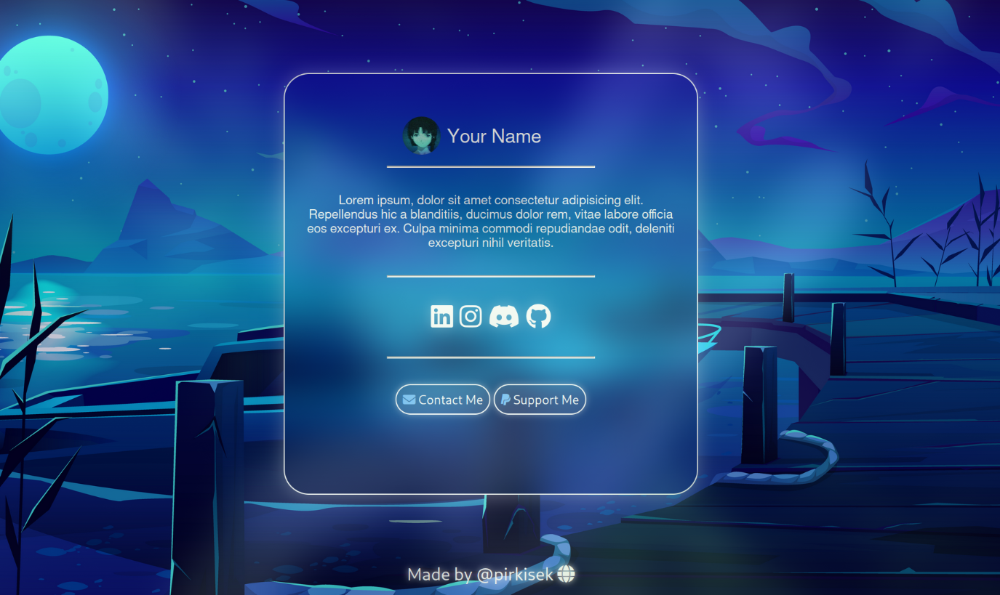

# Profile Card

Profile card project. It is free to use, but you have to give me some credit(so just dont delete the credits part)

## How to setup

### How to add a custom profile picture?
Go to files and replace `pfp.jpg` with your own image and name it `pfp.jpg`

### How to add your name?
Go to index.html to line `14`. There replace the `Your name` text with your own

### How to add your about me
Go to index.html a line `13` and chane the text here  
 Also change the `Your Name` on line `6`

### How to change the background 

Replace `wallpaper.jpg` in the files with your own image and name it `wallpaper.jpg`

### How to add your own socials? 
Go to line `21 - 24` in `index.html` and replace the links

### How to add your own mail and paypal link?
Go to line `21` in `main.js` and replace the mail with your link
Go to line `25` in `main.js` and replace the link with your paypal link

## Screenshots

## Authors

- [@re1exe](https://www.github.com/re1exe)

